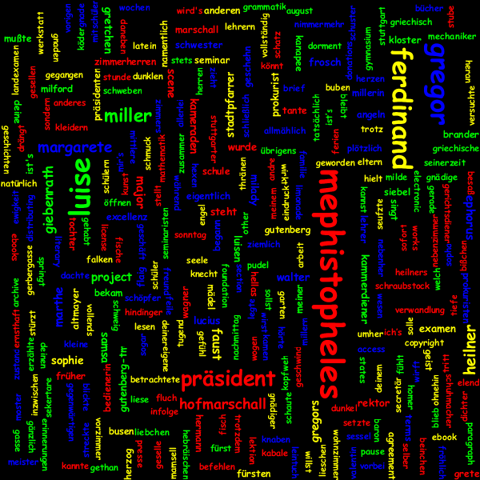
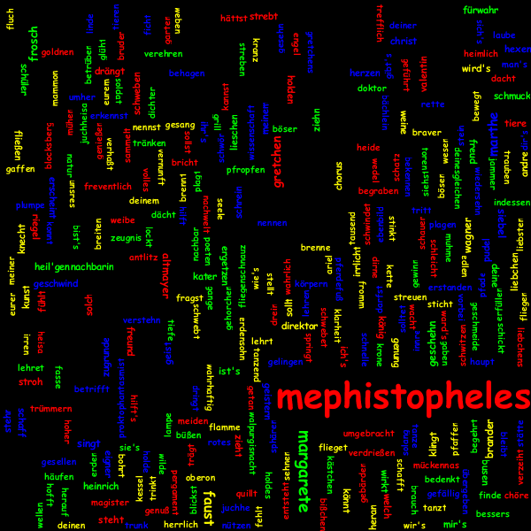

# Tag Cloud

## Anwendung ausführen
Dieses Java-Projekt stellt eine Spring Boot Web-Anwendung dar und verwendet Hadoop der Version 3.3.0.
Für die Ausführung der Anwendung sind keine Konfigurationsschritte notwending,
wobei die Arbeitsverzeichnisse der Anwendung in der `application.properties`-Datei beliebig konfiguriert werden können.
Die Anwendung läuft auf dem Port 8090.

## Beispiel: Tag Cloud für den gesamten Dokumentenbestand (normalisiert)

## Beispiel: Tag Cloud für das Dokument Faust.txt (normalisiert)
